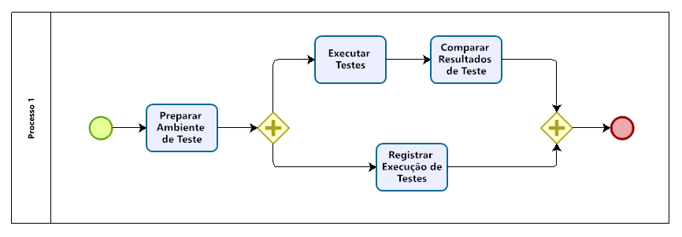

<!---->
<div align=center>
  
</div>

# <p style="text-align: center;">Processo de Teste de Software</p>

<b>
<p style="text-align: center;">Universidade Federal de Goiás</p>
<p style="text-align: center;">Instituto de Informática</p>
<p style="text-align: center;">Bacharelado em Enenharia de Software</p>
<p style="text-align: center;">INF303 Teste de Software - 2021/2</p>
<p style="text-align: center;">Professor: Gilmar Ferreira Arantes</p>
<p style="text-align: center;">Aluno 1: (201804673) Kesley Rozas dos Santos</p>
<p style="text-align: center;">Aluno 2: (201804642) Carlos Henrique Silva Bispo Rodrigues</p>
<p style="text-align: center;">Aluno 3: (201905543) Mateus da Silveira Batista</p>
<p style="text-align: center;">Aluno 4: (201802760) Dener Pereira Barbosa</p>
<p style="text-align: center;">Aluno 5: (202000300) Alexandre Wagner Cardoso Rodrigues</p>
</b>

## Histórico

| Versão | Data       | Alteração                             | Autor          |
| ------ | ---------- | ------------------------------------- | -------------- |
| 0.1    | 24/04/2019 | Elaboração do Documento               | gilmar.arantes |
| 0.2    | 26/04/2019 | Revisão da versão 0.1                 | gilmar.arantes |
| 0.3    | 08/08/2019 | Correções e Atualizações              | gilmar.arantes |
| 0.4    | 24/06/2020 | Adaptação às novas tecnologias da STI | gilmar.arantes |

# Introdução

<span style="color:blue">
<p>O processo de teste será usado para apoiar um projeto de desenvolvimento. Esse documento será utilizado para guiar os processos do projeto, descrever os requisitos a testar, os tipos de testes definidos, os recursos de hardware e software serem empregados, cronograma dos testes e entregas do projeto.</p>
</span>

<!---->
<div align="center">
  
  <figcaption><br/>Figura 1 - Etapas do Processo de Teste</figcaption>
  </div>
<br>

#### Planejar
<span><p>Nesta etapa procura-se entender, inicialmente: Metas e objetivos do projeto e do cliente; Riscos do projeto; Escopo do trabalho;</p><p>Os principais objetivos da etapa de planejamento são verificar a missão, definir os objetivos e as atividades de teste a serem realizadas.</p><p>É durante essa etapa que se cria o Plano de Teste, um documento que descreve o escopo, abordagem, recursos e cronograma das atividades de teste. Nele, estão documentadas as exceções quanto à abordagem do teste, recursos a serem utilizados, equipe envolvida e as técnicas a serem aplicadas.</p></span>
#### Projetar
<span><p>É durante a etapa de Projetar (Análise e Modelagem), que as condições do teste são produzidas.</p><p>Uma Condição de Teste define “o quê” será testado. Pode ser definida, de acordo com o BSTQB, como um item ou evento de um componente ou sistema que pode ser verificado por meio de um ou mais casos de teste. Ou seja, pode ser uma função, transação, característica, atributo de qualidade ou elemento estrutural. Tem como propósito transformar os objetivos do teste em algo tangível.</p><p>Essa etapa do processo de teste tem o propósito de exercitar eficientemente as condições de uso do software, procurando atingir o máximo de cobertura com o mínimo de casos de teste.</p><p>Aqui, especificamos as condições de teste (cobertura de itens) para um item de teste (componente ou funcionalidade do software que deve ser testado), detalhando a abordagem do teste e identificando os casos de teste de alto nível associados.</p></span>
#### Executar
<span><p>Durante a etapa de Implementação e Execução do teste, procura-se realizar a especificação dos procedimentos e/ou scripts de teste através da combinação de casos de teste em ordem particular.</p><p>Ou seja: é hora de transformar condições de teste em casos e procedimentos de teste. Casos de teste lógicos devem ser transformados em casos de teste concretos, que serão utilizados posteriormente para a execução.</p></span>
#### Entregar
<span><p>Na última etapa desse processo, realiza-se as Atividades de Encerramento do teste, onde coletamos todos os dados de todas as outras etapas para consolidar a experiência final obtida, fatos e números consolidados.</p><p>Ainda checamos se todos os entregáveis planejados foram realmente entregues, fechamos relatórios e incidentes, documentamos o aceite do sistema, ambientes de teste, infraestrutura de teste para reuso, analisamos as lições aprendidas para determinar as mudanças para futuros projetos, e melhoramos a maturidade dos testes com as informações obtidas.</p></span>

## Papéis

||Coordenador de Testes|Líder de Testes|Arquiteto de Testes|
|------|------|------|------|
|Estudo do Projeto|Executa|Colabora|Colabora|
|Avaliação de Impacto|-|Executa|Executa|
|Análise Interna Esforço|-|Executa|Executa|
|Análise Externa Esforço|-|Executa|Executa|
|Definição de Cenários Possíveis|Executa|Colabora|Colabora|
|Aprovação do Planejamento|Executa|Colabora|Colabora|

## Ambiente de teste

<span style="color:blue">Descrever o ambiente de testes, que envolve tanto software, quanto infraestrutura.</span>

# Planejar

<!---->
<div align="center">
  
  <figcaption><br/>Figura 2 - Fase de planejamento</figcaption>
  </div>
<br>

<span style="color:blue">Descrever a fase de planejamento, junto com suas respectivas tarefas e papéis responsáveis. Criar um diagrama bpm para apresentar visualmente as atividades componentes desta fase.</span>

## Atividade - Definir conjunto de funcionalidades
```diff
- Existem duas dessa atividade, Esta e um 'Identificar Conjunto de Funcionalidades', e de acordo com a norma ela pertence a Projeto.
```

<span style="color:blue">
  Analisar o plano de testes e definir a partir dos requisitos todas funcionalidades do software que serão testadas, admitindo todos as funções de uso do software em questão, fazer fluxo de controle do software
</span>

### Responsável(eis):

<span style="color:blue">
  Analista de software
</span>

### Quando:

<span style="color:blue">
  Software aprovado para testes, plano de teste definido
</span>

### Como:

<span style="color:blue">
  como é a execução da atividade?
</span>

### Prazo:

<span style="color:blue">
  qual o prazo para execução?
</span>

### Entradas:

<span style="color:blue">
  quais são as entradas que subsidiam a execução?
</span>

### Saídas:

<span style="color:blue">
  quais são as saídas geradas pela execução?
</span>

### Fluxo:

<span style="color:blue">
  qual a próxima atividade a ser executada na sequencia?
</span>

## Atividade - Projetar Estratégia de Testes

<span style="color:blue">
A estratégia de teste é um passo crítico na criação de um plano de teste. Um documento de estratégia de teste, é um documento de alto nível, geralmente desenvolvido pelo Arquiteto de Testes. Este documento define:

Os objetivos de teste do projeto e os meios para alcançá-los Determina o esforço e os custos do teste.

</span>

### Responsável(eis):

<span style="color:blue">
  	Coordenador de Testes, Arquiteto de Testes
</span>

### Como:

#### Definir o escopo do teste

<span style="color:blue">

O escopo do teste deve ser conhecido para que seja realizado o teste engolando do o escopo.

Os componentes do sistema a serem testados (hardware, software, middleware, etc.) são definidos como "no escopo".

Os componentes do sistema que não serão testados também precisam ser claramente definidos como "fora do escopo". Definir o escopo do seu projeto de teste é muito importante para todas as partes interessadas. Dê a todos uma confiança e informações precisas dos testes que você está fazendo todos os membros do projeto terão uma compreensão clara sobre o que é testado e o que não é.

Como vamos determina o escopo do seu projeto?

Para determinar o escopo, você precisará:

  - Exigência precisa do cliente
  - Orçamento do projeto
  - Especificação do produto</span>

#### Identifique o tipo de teste

<span style="color:blue">

Um tipo de teste é um procedimento de teste padrão que fornece um resultado de teste esperado.

Cada tipo de teste é formulado para identificar um tipo específico de problemas em um produto. Porém, todos os tipos de testes visam atingir um objetivo comum: "Detecção antecipada de todos os defeitos antes de liberar o produto para o cliente"

Neste momento deve-se definir quais os tipo de testes serão realizados:

  - Teste de Aceitação
  - Teste de Sistema
  - Teste de Integração
  - Teste de Unidade

</span>

#### Criar Logística de Teste

<span style="color:blue">

Nesta etapa o Coordenador de Teste deve responder às seguintes perguntas: Quem vai testar? Quando o teste ocorrerá? Quem vai testar?

Inicie selecionando o membro certo para a tarefa especificada, você deve considerar se a habilidade dele está qualificada para a tarefa ou não, também estimar o orçamento do projeto. Selecionar um membro errado para a tarefa pode causar falha ou atraso no projeto. A pessoa com as seguintes habilidades é a mais ideal para realizar testes de software:

  - Capacidade de entender o ponto de vista dos clientes
  - Forte desejo de qualidade
  - Atenção aos detalhes
</span>

#### Definir critérios de teste

<span style="color:blue">
Deve se definir alguns critérios de testes para se obter agilidade no projeto, existem 2 tipos de critérios de teste que podem ser utilizados são eles:

Critérios de Suspensão

Especifique os critérios críticos de suspensão para um teste. Se os critérios de suspensão forem atendidos durante o teste, o ciclo de teste ativo será suspenso até que os critérios sejam resolvidos.

Exemplo: se os membros da sua equipe relatarem que 40% dos casos de teste falharam, você deverá suspender o teste até que a equipe de desenvolvimento corrija todos os casos com falha.

Critério de saída

Especifica os critérios que indicam uma conclusão bem-sucedida de uma fase de teste. Os critérios de saída são os resultados desejados do teste e são necessários antes de prosseguir para a próxima fase de desenvolvimento. Exemplo: 95% de todos os casos de teste críticos devem passar.</span>

### Fluxo:

<span style="color:blue">a proxima atividade e: Determinar Equipe e Agendamento</span>


## Atividade - Determinar Equipe e Agendamento

<span style="color:blue">Agora neste atividade deve ser incluir a estimativa do tempo de cada tarefa a ser realizada, bem como a identificação das funções e habilidade da equipe para realizar os testes descritos no planejamento identificado. Essa atividade pode exigir a identificação das necessidadas de recrutamento ou treinamento de pessoal.</span>

### Responsável(eis)

<span style="color:blue">Coordenador de Testes - Com base na estimativa, o Tester sabe quanto tempo leva para concluir o projeto. Então ele pode fazer o cronograma do projeto apropriado.</span>

### Como

<span style="color:blue">Cada atividade de teste necessária na Estratégia de Teste deve ser agendada com base nas estimativas, dependências
e disponibilidade de pessoal, fazendo um cronogram para o gerenciamento, para poder utilizar no momitoramento do progresso do projeto.</span>
<span style="color:blue">A aprovação de pessoal e programação deve ser obtida das partes interessadas relevantes.</span>

### Entradas

<span style="color:blue">Para criar o cronograma do projeto, o Coordenador de Testes precisa de vários tipos de entrada, conforme abaixo:</span>
<span style="color:blue">Prazo para funcionários e projetos: os dias úteis, o prazo final do projeto, a disponibilidade de recursos são os fatores que afetaram o cronograma</span>
<span style="color:blue">Estimativa de projeto: Com base na estimativa, o Coordenador de Testes sabe quanto tempo leva para concluir o projeto. Então ele pode fazer o cronograma do projeto apropriado.</span>

### Fluxo:

<span style="color:blue">a proxima atividade e: Registrar Plano de Teste</span>

## Atividade - Registrar Plano de Teste

<span style="color:blue">Nesta atividade deve se registrar o plano de teste com base nas estimativas e estrátegias definidas.</span>

### Responsável(eis):

<span style="color:blue">Lider de Teste, Arquiteto de Teste</span>

### Como:

<span style="color:blue">As estimativas finais para o teste devem ser calculadas com base na estratégia de teste projetada no Teste de Projeto Atividade de estratégia e a equipe e agendamento acordados na Determinação de Pessoal e Programação atividade.</span>
<span style="color:blue">A Estratégia de Teste identificada na atividade Criar Estratégia de Teste, o perfil de pessoal e cronograma acordado na atividade Determinar Pessoal e Agendamento, e as estimativas finais calculadas no tarefa anterior deve ser incorporada no plano de teste.</span>

### Entradas:

<span style="color:blue">Para registrar o teste, o Lider de Teste precisa da entrada, conforme abaixo:</span>
<span style="color:blue">Documentações anteriores para analise, para registrar o plano.</span>

### Fluxo:

<span style="color:blue">a proxima atividade e: Obter consenso sobre o plano de teste</span>

## Atividade - Obter consenso sobre o plano de teste

<span style="color:blue">Nesta etapa devemos conectar as partes interessadas para alhinhar opniões sobre o plano de teste para avalisar o desenvolviemento do plano.</span>

### Responsável(eis):

<span style="color:blue">Coordenador de Testes</span>

### Como:

<span style="color:blue">
As opiniões das partes interessadas sobre o plano de teste devem ser coletadas.</br>
Os conflitos entre o plano de teste e as opiniões das partes interessadas devem ser resolvidos.</br>
O plano de teste deve ser atualizado para levar em consideração o feedback das partes interessadas.</br>
A aprovação do plano de teste deve ser obtida das partes interessadas.
</span>

### Entradas:

<span style="color:blue">
  Para criar o cronograma do projeto, o Coordenador de Testes precisa de vários tipos de entrada, conforme abaixo: </br>
  Isso pode ser alcançado por meio de workshops, entrevistas ou outros meios adequados.
  </span>

### Fluxo:

<span style="color:blue">a proxima atividade e: Projetar os Casos de Teste</span>

# Projetar os Casos de Teste

<span style="color:blue">Analise do plano de testes e projeto de testes pelo analista, definindo os requisitos a serem testados e processo de teste a serem melhorados e casos de testes</span>

## Identificar Conjunto de Funcionalidades

### Responsável(eis):
<span style="color:blue">Analista de software</span>

### Quando:
<span style="color:blue">Plano de testes definido e aprovado</span>
### Como:
<span style="color:blue">Analista de software consulta plano de testes e seleciona requisitos funcionais que sejam passiveis de teste, documentando no plano a lista de requisitos que serão testados</span>
### Prazo:
<span style="color:blue">Algumas horas</span>
### Entradas:
<span style="color:blue">Plano de testes, documentação de requisitos</span>
### Saídas:
<span style="color:blue">Conjunto de funcionalidades identificadas</span>
### Fluxo:
<span style="color:blue">Derivar condições de teste</span>

## Derivar condições de teste

### Responsável(eis):
<span style="color:blue">Analista de software</span>
### Quando:
<span style="color:blue">Requisitos a serem testados definidos</span>
### Como:
<span style="color:blue">Definir Condições de teste para cada requisito a ser testado, atraves de particionamento por equivalencia e analises de valor limite</span>
### Prazo:
<span style="color:blue">algumas horas</span>
### Entradas:
<span style="color:blue">Plano de testes, documentação de requisitos</span>
### Saídas:
<span style="color:blue">Condições a serem testadas, estados a serem testados, preparação para casos de teste definidas em gráfico de causa e efeito</span>
### Fluxo:
<span style="color:blue">Derivar itens de cobertura de teste</span>

## Derivar itens de cobertura de teste

### Responsável(eis):
<span style="color:blue">Analista de software</span>
### Quando:
<span style="color:blue">grafico de causa e efeito construido, plano de testes definido e condições a serem testadas definidas</span>
### como
<span style="color:blue">Analista observa quais funções do sistema realizam as ações a serem testadas e isola funcionalidades para teste, definindo funções do software para teste das causas definidas no grafico</span>
### Prazo:
<span style="color:blue">Algumas horas</span>

### Entradas:
<span style="color:blue">Gráfico de causa e efeito, plano de testes, documento de requisitos</span>

### Saídas:
<span style="color:blue">Lista de arquivos onde será realizado os testes e funções do programa a serem testadas</span>
### Fluxo:
<span style="color:blue">Derivar Casos de Teste</span>

## Derivar Casos de Teste

### Responsável(eis):
<span style="color:blue">Analista de software</span>
### Quando:
<span style="color:blue">Funções do programa definidas pra teste e isoladas, preparadas para teste. Grafico de causa e efeitos esperados definidos</span>
### como
<span style="color:blue">Melhoramento do documento de planos de teste e casos de teste após analisar </span>
### Prazo:
<span style="color:blue">1 dia</span>
### Entradas:
<span style="color:blue">Documento de requisitos, graficos de causa e efeito, plano de testes com especificação de testes</span>
### Saídas:
<span style="color:blue">Casos de testes especificados e prontos para execução</span>
### Fluxo:
<span style="color:blue">Montar conjunto de testes</span>

## Montar conjunto de testes

### Responsável(eis):
<span style="color:blue">Analista de software</span>

### Quando:
<span style="color:blue">Casos de testes definidos</span>
### Como:
<span style="color:blue">O analista observa os casos de testes e separa as tabelas conforme o plano de teste, dividindo quem e quais serão as baterias de testes</span>
### Prazo:
<span style="color:blue">Algumas horas</span>
### Entradas:
<span style="color:blue">Plano de testes, casos de teste</span>
### Saídas:
<span style="color:blue">Conjunto de tabelas de casos de teste, com seus responsáveis</span>
### Fluxo:
<span style="color:blue">Derivar Processo de teste</span>

## Derivar processos de teste:

### Responsável(eis):
<span style="color:blue">Analista de software</span>

### Quando:
<span style="color:blue">Casos de testes definidos</span>
### Como:
<span style="color:blue">O analista acrescenta ao plano de testes os processos especificados de testes, as baterias e responsabilidades distribuidas para cada sessão de testes</span>
### Prazo:
<span style="color:blue">Algumas horas</span>
### Entradas:
<span style="color:blue">Plano de testes, casos de teste</span>
### Saídas:
<span style="color:blue">Plano de teste com seus responsaveis e casos de teste prontos para execução</span>
### Fluxo:
<span style="color:blue">Execução</span>


# Executar

<span style="color:blue">Descrever a Executar, junto com suas respectivas tarefas e papéis responsáveis. Criar um diagrama bpm para apresentar visualmente as atividades componentes desta fase.</span>



## Atividade - Preparar Ambiente de Teste

<span style="color:blue">
  Um ambiente de teste é preparado, simulando o ambiente de implanatação do software, o que garante uma maior precisão na execução dos testes. </br>
  O ambiente de teste está sujeito à alterações baseadas nas necessidades ou resultados de testes. 
</span>

### Responsável(eis):

<span style="color:blue">
  Gerente de Configuração </br>
  Tester
</span>

### Quando:

<span style="color:blue">
  Antes de realizar os testes.
</span>

### Como:

<span style="color:blue">
  O ambiente de teste deve ser preparado de acordo com as Configurações de Ambiente de Teste resultadas da atividade 'Derivar Condições de Teste'.
</span>

### Prazo:

<span style="color:blue">
  1 dia.
</span>
  
### Entradas:

<span style="color:blue">
  Plano de Teste </br>
  Condições de Teste </br>
  Estados de Teste  
</span>

### Saídas:

<span style="color:blue">
  Aprovação para Execução de Testes.
</span>

### Fluxo:

<span style="color:blue">
  Executar Testes </br>
  Registrar Execução de Teste.
</span>

## Atividade - Executar Testes

<span style="color:blue">
  Os testes são executados de acordo com o planejado e seus resultados são registrados.
</span>

### Responsável(eis):

<span style="color:blue">
  Tester
</span>

### Quando:

<span style="color:blue">
  
  - Após preparação do Ambiente de Teste. </br>
  - Após o projeto de testes do componente a ser testado for concluido.

</span>

### Como:

<span style="color:blue">
  Cada caso de teste deve ser executado de acordo com o especificado na fase de projeto de teste.   
</span>

### Prazo:

<span style="color:blue">
  Não Definido.
</span>
  
### Entradas:

<span style="color:blue">
Aprovação para Execução de Teste. </br>
Conjunto de Testes. 
</span>

### Saídas:

<span style="color:blue">
Resultados Atuais de Testes. 
</span>

### Fluxo:

<span style="color:blue">
  Comparar Resultados de Testes. </br>
  Registrar Execução de Testes.
</span>

## Atividade - Comparar Resultados de Testes

Os resultados dos testes são comparados com as saidas esperadas, para verificar se o software está funcionando corretamente

### Responsável(eis):

<span style="color:blue">
Tester 
</span>

### Quando:

<span style="color:blue">
Imediatamente após as execução dos testes. 
</span>

### Como:

<span style="color:blue">
  Os resultados de teste obtidos durante a fase de execução devem ser comparados com os resultados esperados do sistema formulados durante a fase de projeto, registrando qualquer divergência encontrada.
</span>

### Prazo:

<span style="color:blue">
Não Definido
</span>

### Entradas:

<span style="color:blue">
Resultados Atuais de Teste </br>
Resultados Esperados de Teste
</span>

### Saídas:

<span style="color:blue">
Resultados de Teste. </br>
Registro de Não Conformidades.
</span>

### Fluxo:

<span style="color:blue">
  Próxima Atividade: Entrega
</span>

## Atividade - Registrar Execução de Teste

<span style="color:blue">
  A execução de testes é registrada.
</span>

### Responsável(eis):

<span style="color:blue">
  Registro de Testes
</span>

### Quando:

<span style="color:blue">
  Durante o processo de execução de testes e comparação de resultados de teste.
</span>

### Como:

<span style="color:blue">
  Atraves de um log de execução dos testes, e registros manuais, caso necessário.
</span>

### Prazo:

<span style="color:blue">
  Não Definido.
</span>

### Entradas:

<span style="color:blue">
  N/A
</span>

### Saídas:

<span style="color:blue">
  Registro de Testes
</span>

### Fluxo:

<span style="color:blue">
  Entrega
</span>

# Entregar

<span style="color:blue">
  Descrever a Entregas, junto com suas respectivas tarefas e papéis responsáveis. Criar um diagrama bpm para apresentar visualmente as atividades componentes desta fase.
</span>

## Atividade 1

### Responsável(eis):

### Quando:

### Como:

### Prazo:

### Entradas:

### Saídas:

### Fluxo:

<span style="color:blue">Identificar e descrever outras atividades componentes desta fase do processo.</span>

# Considerações Finais
<span style="color:blue">Descrever as considerações finais a respeito deste processo de teste de software.</span>

